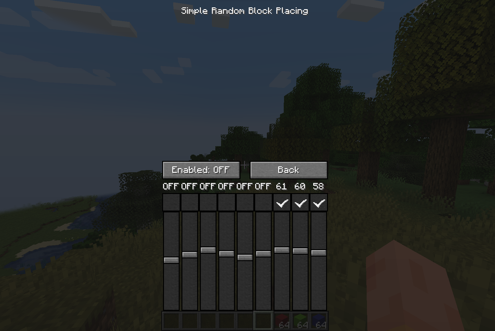

# Simple Random Block Placing

Fabric client-side mod to help you randomize blocks while building. 

After placing a block, mod will try to choose next random hotbar slot with blocks.
Chance for each slot can be configured in GUI.

### Commands
Mod commands `/srbp` and `/randomblock` are equivalent.

- `/srbp screen` or `/srbp` - open mod Screen
- `/srbp toggle` - toggle enabled state
- `/srbp config <option> <value>` - change config values (only `save_enabled_state` at this point)

